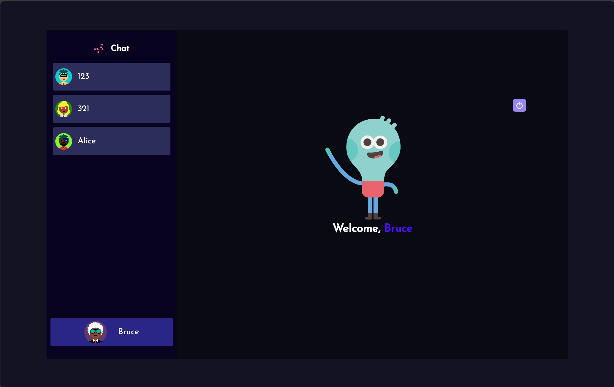

### About Project Chatroom
Project Chatroom is a dynamic and interactive web application designed to facilitate real-time communication among users. Utilizing a robust stack of modern technologies, this project aims to provide a seamless chat experience with a focus on security, efficiency, and user-friendly design.

**Main Technical Stack:**

- **Programming Language**: The application is primarily built using JavaScript for its versatile and widely-supported nature, coupled with SQL for managing and querying relational database systems.

- **Front-end Framework**: React is employed to create a responsive and interactive user interface. This popular JavaScript library enables the development of a rich, single-page application with real-time updates.

- **Back-end Framework**: Express, a minimal and flexible Node.js web application framework, is used to handle HTTP requests, route management, and other server-side functionalities.

- **Style Management**: Styled-components are utilized for styling, leveraging tagged template literals to style components directly within JavaScript. This approach ensures a modular and reusable styling architecture.

- **Password Encryption**: To enhance security, bcrypt is used for hashing and securing user passwords, providing a robust mechanism against password theft.

- **Token Distribution**: JWT (JSON Web Tokens) asymmetric encryption technique is adopted for secure token distribution. This method ensures secure transmission of information between parties as JSON objects, enabling authenticated and encrypted API requests.

- **Real-time Message Transmission**: Socket.io-client is integrated to facilitate real-time, bidirectional, and event-based communication, making the chat experience instantaneous and dynamic.

- **HTTP Tools**: Axios, a promise-based HTTP client, is used for making HTTP requests from the browser, simplifying the process of communicating with back-end services.

# Project Demo

## Login page

## Register Page

## Welcome Page

## Chat Page

